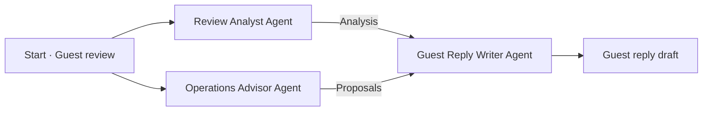

# AI Agent Hands-On Workshop

A beginner-friendly, hands-on introduction to multi-agent systems. Build and run a hotel review response workflow, then learn how to adapt the same approach to your own assignments or work.

**Assign roles. Pass information. Combine and improve results.**

No programming experience or local installation is required. Bring a laptop with a web browser, internet access and access to your email for account verification.

## Start the workshop

- **[Workshop guide](https://soohyunme.github.io/ai-agent-team-workshop/)**
- After the presentation, begin with **[Step 2: OpenRouter setup](https://soohyunme.github.io/ai-agent-team-workshop/en/step-2.html)**.
- [All steps on one page](https://soohyunme.github.io/ai-agent-team-workshop/all.html)

The 90-minute workshop starts with a short concept introduction and GitHub sign-in, then follows the guide together. You do not need a GitHub account to read the materials.

## What you will build

Three agents handle the same fictional hotel review from different perspectives:

| Agent | Job |
| --- | --- |
| **Review Analyst** | Identify positive feedback and concerns with evidence from the review. |
| **Operations Advisor** | Suggest internal checks and improvements. |
| **Guest Reply Writer** | Use the review and both results to draft a guest reply. |

The first two agents work independently. The reply writer then uses the original review and both results. The draft is the output, not a fourth agent.

One AI can write a reply. Dividing the work makes it easier to review and improve each agent's output. In this exercise, you define the roles and connections; the agents do not choose their own team structure.

## Build first, then improve

1. **Set up — steps 2–3.** Sign in to OpenRouter and Sim and connect your API key.
2. **Build — steps 4–6.** Start with an empty workflow. Add the review, create three agents, write their instructions and connect their inputs and results.
3. **Run — step 7.** Run the basic workflow and inspect what each agent produces.
4. **Improve — step 8.** Change the reply writer's request and compare the result. Try a more challenging fictional complaint if time allows.
5. **Extend — step 9, optional.** Design a team for your own task. Start if time remains, or continue after the workshop.

The core exercise finishes at step 8. You do not need to build a second team during the session.

## Tools used

- **Sim:** arrange the agents, give them instructions and run the workflow.
- **OpenRouter:** connect the workflow to AI models.
- **GitHub:** find the materials and use a common sign-in option for the workshop services. Existing service accounts can also be used.

Sim is the tool for this exercise, not the learning goal or the only way to build agents. Focus on which roles you need, what information they share and how you check their results.

The guide uses a free-model configuration. Availability and usage limits still apply; free access is not unlimited. Keep API keys private, and ask the facilitator before purchasing or upgrading anything during the workshop.

## Make it your own

Choose a task and define its **goal, roles, information handoffs and checks**. For example, a presentation workflow might summarize supplied materials, draft an outline and check the evidence. Your task may need a sequence rather than today's parallel structure—or only one AI.

Your own know-how can become instructions, examples, checklists and reference material for each role. Review the results and refine that guidance over time. This adapts the agent's instructions and context; it does not automatically retrain the underlying model.

## Reference workflow

[Download the completed hotel review example · Sim JSON](https://soohyunme.github.io/ai-agent-team-workshop/assets/templates/hotel-review-response-team-example-v1.0.json)

This is a reference and recovery option, not the main exercise. Participants normally build the workflow themselves. If you get stuck, follow the import instructions in step 4 with the facilitator's help. Importing the example still requires your own working model connection.

## Questions and feedback

- Found an issue in the materials? [Open a GitHub issue](https://github.com/soohyunme/ai-agent-team-workshop/issues).
- Questions after the session? [Message Soohyun Kim on LinkedIn](https://www.linkedin.com/in/soohyun-dev/).
- Want to find the materials again? You can star this repository. It is optional.

Maintaining the guide

The default guide is nine separate pages with previous/next navigation. The full-guide page reuses the same content for review and printing. Participant-facing instructions use direct actions and question-based checks; facilitation and validation notes should remain separate from those instructions.

Edit the step text in `docs/_includes/steps/en/`. Titles, tasks, completion checks and URLs are in `docs/_data/steps.json`. The files `docs/index.md` and `docs/en/step-*.md` select each page; they do not duplicate the lesson content.

The template lives in `docs/assets/templates/`. Keep actual API keys out of all files; the template uses only `{{OPENROUTER_API_KEY}}`. The literal key placeholder is protected with Liquid raw tags in the step content so that it remains visible after the Pages build.

GitHub Pages publishes `main` → `/docs` using its built-in Jekyll build. No external fonts, analytics or local build dependencies are required. The small layout and stylesheet are in `docs/_layouts/` and `docs/assets/`. A small script supports the optional copy button in step 4; manual selection and copying work without JavaScript.

Step 4 embeds a download fallback in `docs/_includes/template-copy.json`, wrapped in Liquid raw tags. Keep its JSON identical to `docs/assets/templates/hotel-review-response-team-example-v1.0.json` when updating the template. This embeds the contents in the guide rather than fetching the download URL again.

Keep facilitator scripts and private preparation notes outside this public repository. When changing the workflow, keep the guide prompts, template and embedded copy consistent, and check import and execution in Sim.

