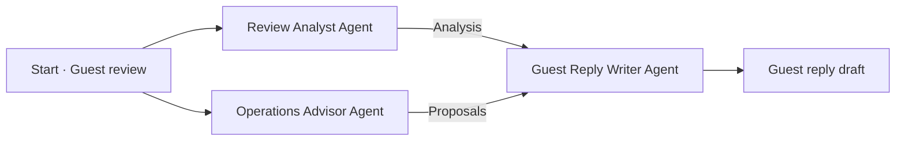

# AI Agent Hands-On Workshop

A beginner-friendly, hands-on introduction to multi-agent systems. Build and run a hotel review response workflow, then learn how to adapt the same approach to your own assignments or work.

**Assign roles. Pass information. Combine and improve results.**

## Start the workshop

- **[Workshop guide](https://soohyunme.github.io/ai-agent-team-workshop/)**
- **[Start the hands-on exercise at Step 2](https://soohyunme.github.io/ai-agent-team-workshop/en/step-2.html)** after the concept presentation and GitHub sign-up or sign-in.
- [All steps on one page](https://soohyunme.github.io/ai-agent-team-workshop/all.html)

**Duration:** 90 minutes, including setup and the core exercise. The extension is optional.

**Bring:** a laptop, a web browser, internet access and access to your email for account verification. No programming experience or local software installation is required. You do not need a GitHub account to read the guide.

## What you will build

Build a workflow that turns a fictional guest review into feedback analysis, internal improvement proposals and a guest reply draft.

| Agent | Job |
| --- | --- |
| **Review Analyst** | Identify positive feedback and concerns with evidence from the review. |
| **Operations Advisor** | Suggest internal checks and improvements. |
| **Guest Reply Writer** | Use the review and both results to draft a guest reply. |

The analyst and operations advisor work independently. Once both finish, the reply writer uses the original review and their results. “Guest reply draft” is the output, not an extra block to create.

One AI can write a reply. Here, separating the roles lets you inspect and improve each contribution. You define the roles and connections, then the agents run within that structure.

## Build first, then improve

1. **Set up — steps 2–3.** Create or sign in to your OpenRouter and Sim accounts, then connect them using an API key.
2. **Build — steps 4–6.** Start with an empty workflow. Add the review, create three agents, write short instructions and connect the roles. Prompt examples are available to copy when needed.
3. **Run — step 7.** Run the basic workflow and inspect each agent's output and the final reply.
4. **Improve — step 8.** Change the reply writer's request to produce a shorter answer that still addresses every concern. Compare the results; try a more challenging complaint if time allows.

**Optional extension — step 9:** design and build an agent team for your own task. Begin if time remains or continue after the workshop; the core exercise ends at step 8.

## Tools used

- **Sim:** arrange the agents, give them instructions and run the workflow.
- **OpenRouter:** connect the workflow to AI models.
- **GitHub:** access the workshop materials and sign in to the workshop services. You can also use existing service accounts.

Sim is our practice tool. The goal is to learn how to assign roles, pass information and check results—principles you can apply with other tools as well.

The exercise is configured to request a free model, but usage and availability limits apply. Keep API keys private. If a service asks for payment, check with the facilitator before purchasing anything.

## Make it your own

Choose a task and define its **goal, roles, information to share and checks**. A presentation workflow, for example, could summarize supplied materials, draft an outline and check the evidence. Choose the structure that fits your task: independent roles, a sequence, or simply one AI.

Turn your own know-how into instructions, examples and checklists for each role, then refine them as you review the results. This customizes the agent's guidance; it does not automatically retrain the AI model.

## Completed example

[Download the completed hotel review example · Sim JSON](https://soohyunme.github.io/ai-agent-team-workshop/assets/templates/hotel-review-response-team-example-v1.0.json)

You will normally build the workflow yourself. If you get stuck, use the [import instructions in step 4](https://soohyunme.github.io/ai-agent-team-workshop/en/step-4.html) with the facilitator's help. The example still needs your OpenRouter API key configured in Sim.

## Questions and feedback

For questions, problems with the materials or suggestions, [message Soohyun Kim on LinkedIn](https://www.linkedin.com/in/soohyun-dev/). Do not include API keys in messages or screenshots.

To find the materials again, you can select **Star** at the top of this repository. This is optional.

Maintaining the guide

- Step content: `docs/_includes/steps/en/`
- Step titles, navigation and completion checks: `docs/_data/steps.json`
- Layout and styling: `docs/_layouts/` and `docs/assets/style.css`
- Completed workflow: `docs/assets/templates/hotel-review-response-team-example-v1.0.json`
- Embedded copy for step 4: `docs/_includes/template-copy.json`

GitHub Pages builds from `main` → `/docs`. The step pages and full-guide page reuse the same content.

When changing the workflow, keep the guide prompts, completed example and embedded copy consistent, then test import and execution in Sim. Preserve the Liquid raw tags around template contents and `{{OPENROUTER_API_KEY}}` references. Never commit actual API keys.

