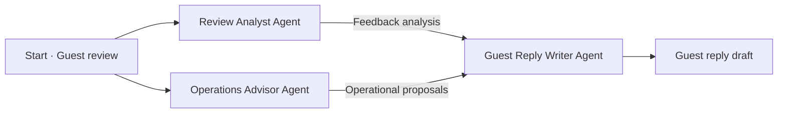

You will build a hotel review response system that reads guest feedback and prepares a response. Divide the work among three roles and pass the information they need to produce internal follow-up proposals and a guest reply draft.

## What you will learn

In this workshop, you will **build a basic multi-agent collaboration structure** by assigning roles to multiple AIs, passing their results and combining them. Hotel review response is our practice example.

You can then apply this approach to design and use roles and collaboration patterns for your own assignments or tasks of interest.

In the core exercise, you will **build and run a hotel review response system**. The goal is to explain who does what and what information they pass on. **Designing and building your own team is an optional extension** to begin if time remains or continue after the workshop.

## What is an AI agent?

**An AI agent is an AI system that determines and carries out the tasks needed to achieve a given goal.**

Here, we divide the work into feedback analysis, operational proposals and guest communication.

## What is a multi-agent system?

A multi-agent system has multiple agents sharing information and responsibilities toward a common goal. This exercise uses a collaboration structure defined by a person; the agents do not choose their own roles or execution order.

## The three AI roles

| Role | Name on screen | Responsibility |
| --- | --- | --- |
| Feedback analyst | Review Analyst | Identify positive feedback and concerns with original evidence |
| Operations advisor | Operations Advisor | Propose internal checks and improvements for the concerns |
| Guest communicator | Guest Reply Writer | Use earlier results to draft a reply for the guest |

## How do the roles work together?

The analyst and operations advisor each read the same review independently. The analyst identifies feedback and evidence; the operations advisor proposes internal checks and improvements. Once both finish, the reply writer compares their results and drafts a response grounded in the original review.

‘Guest reply draft’ represents the output, not an additional block to create in Sim.

Use parallel branches when tasks can work independently, as here. Use a sequence when one task needs another's result. Parallel is not always better.

## Why divide the work?

One AI could write a simple review response. As the amount of information grows, or different activities such as analysis, judgment and communication become connected, dividing responsibilities can help. Clear roles can make it easier to inspect intermediate results and revise the part where a problem occurs, rather than assigning everything to one AI.

In this exercise, we separate analysis, internal proposals and external communication to practice passing information and reviewing results. The point is not to increase the number of agents, but to **design roles and collaboration that fit the task**.

## What you need

Prepare a laptop, an internet connection and access to your email for account verification. The exercise runs in a web browser and does not require programming experience.

Keep this guide in one tab and open the workshop services in other tabs.

## Services used in the workshop

| Service | Purpose |
| --- | --- |
| Sim | View the team, edit its instructions and run it |
| OpenRouter | Connect to AI models to send requests and receive answers |

Sim is our hands-on tool for arranging and running this structure, not the only way to build agents. Rather than focusing on Sim's features, focus on **which roles you need, what they should pass on and how to check their results**. These principles also apply when building agent teams with other tools.

In this exercise, Sim sends requests to AI models through OpenRouter. You will prepare the **API key** needed to connect the two services in the next step.

For now, just review what each service does. Sign up and configure the services in order: **step 2 for OpenRouter → step 3 for Sim**.

The exercise is configured to request a free model. Usage or access restrictions may affect availability. If you see a payment or upgrade request, contact the facilitator before making a purchase.
