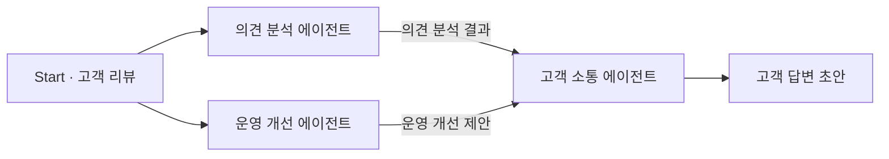

이 실습에서는 고객 리뷰를 읽고 대응을 준비하는 호텔 리뷰 대응 시스템을 만듭니다. 세 담당자에게 일을 나누어 맡기고 필요한 정보를 전달해, 내부 조치 제안과 고객 답변 초안을 만듭니다.

## 이 실습에서 배우는 것

이번 실습에서는 여러 AI에 역할을 나누어 맡기고, 각 역할의 결과를 전달·취합하는 **멀티 에이전트의 기본 협력 구조를 직접 만들어봅니다.** 호텔 리뷰 대응은 이 과정을 경험하기 위한 예시입니다.

이를 바탕으로 자신의 과제나 관심 있는 작업에 필요한 역할과 협력 방식을 설계하고 활용할 수 있습니다.

기본 실습에서는 **호텔 리뷰 대응 시스템을 직접 구성하고 실행합니다.** 누가 어떤 일을 맡고 무엇을 전달하는지 설명할 수 있는 것이 목표입니다. **나만의 팀 설계와 구현은 선택 심화 과제**로, 시간이 남으면 시작하거나 워크숍 이후에 진행합니다.

## AI 에이전트란 무엇인가요?

**AI 에이전트는 주어진 목표를 수행하기 위해 필요한 작업을 판단하고 실행하는 AI 시스템입니다.**

이번에는 고객 의견 분석, 운영 개선 제안, 고객 답변 작성이라는 역할을 나눕니다.

## 멀티 에이전트 시스템이란 무엇인가요?

멀티 에이전트 시스템은 여러 에이전트가 역할을 나누고 정보를 주고받으며 공동의 목표를 수행하는 구조입니다. 이번에는 사람이 미리 정한 협력 구조로 결과를 전달하며, AI가 스스로 역할이나 실행 순서를 정하지는 않습니다.

## 세 AI의 역할

| 역할 | 화면에 표시되는 이름 | 하는 일 |
| --- | --- | --- |
| 고객 의견 분석 담당 | Review Analyst | 긍정·불편 사항을 원문 근거와 함께 정리 |
| 운영 개선 담당 | Operations Advisor | 불편 사항에 대한 내부 확인·개선안을 제안 |
| 고객 소통 담당 | Guest Reply Writer | 앞의 결과를 참고해 고객에게 보낼 답변 초안 작성 |

## 어떻게 협력하나요?

분석 담당과 운영 담당은 같은 리뷰를 각각 읽습니다. 분석 담당은 고객의 의견과 근거를 정리하고, 운영 담당은 내부 확인 사항과 개선안을 제안합니다. 소통 담당은 두 작업이 모두 끝나면 결과를 비교하고 원문에 맞는 고객 답변으로 정리합니다.

‘고객 답변 초안’은 결과물을 표시한 것이며, Sim에서 추가할 블록은 아닙니다.

이번처럼 서로의 결과 없이 작업할 수 있으면 병렬로, 앞 담당자의 결과가 필요한 작업이면 순차적으로 연결합니다. 병렬형이 항상 더 좋은 것은 아닙니다.

## 왜 역할을 나누나요?

단순한 리뷰 답변은 AI 하나로도 만들 수 있습니다. 하지만 처리할 정보가 많아지거나 분석·판단·소통처럼 서로 다른 작업이 연결되면, 한 AI에게 모든 일을 맡기기보다 역할을 나누는 방식이 도움이 될 수 있습니다. 각 역할의 책임을 명확히 하고, 중간 결과를 확인하거나 문제가 생긴 부분을 수정하기 쉬워지기 때문입니다.

이번 실습에서는 분석·내부 제안·외부 소통을 세 역할로 나누어, 필요한 정보를 전달하고 결과를 검토하는 과정을 경험합니다. 중요한 것은 에이전트의 수를 늘리는 것이 아니라, **작업에 맞게 역할과 협력 방식을 설계하는 것**입니다.

## 준비물과 진행 방법

노트북, 인터넷 연결, 이메일 인증을 확인할 수 있는 계정을 준비하세요. 실습은 웹 브라우저에서 진행하며 프로그래밍 경험은 필요하지 않습니다.

가이드는 한 탭에 열어 두고, 실습 사이트는 다른 탭에서 이용하세요.

## 실습에 사용하는 서비스

| 서비스 | 용도 |
| --- | --- |
| Sim | AI 팀의 구성을 보고 지시문을 수정·실행하는 화면 |
| OpenRouter | AI 모델에 요청을 보내고 답변을 받기 위한 연결 서비스 |

Sim은 이 구조를 화면에서 구성하고 실행하기 위한 실습 도구이며, 에이전트를 만드는 유일한 방법은 아닙니다. Sim의 기능을 익히는 것보다 **어떤 역할이 필요한지, 무엇을 전달할지, 결과를 어떻게 확인할지**에 집중하세요. 이 원리는 다른 도구로 에이전트 팀을 구성할 때도 적용할 수 있습니다.

실습에서는 Sim에서 OpenRouter를 통해 AI 모델에 요청을 보냅니다. 두 서비스를 연결하는 데 필요한 **API 키**는 다음 단계에서 준비합니다.

지금은 각 서비스의 용도만 확인하세요. 회원가입과 설정은 **2단계 OpenRouter → 3단계 Sim** 순서로 진행합니다.

실습에서는 무료 모델을 요청하는 설정을 사용합니다. 서비스의 사용량이나 접근 제한으로 실행이 어려울 수 있습니다. 결제·업그레이드 안내가 나타나면 임의로 구매하지 말고 진행자에게 문의하세요.
